# 脱ドパ UI/UXレビュー & デザイン提案

実機相当(390×844 / モバイルUA)のExpo Web上でアプリを実際に起動・操作し、オンボーディング → ホーム → ロング → メニュー → リザルトの全フローをユーザー目線で確認したレビュー。後半に、脱ドパの世界観(オフホワイト + ネイビー + パステル、脱力系コピー)を崩さずに洗練させる3方向のデザイン案とモックを載せている。

- 現状のスクリーンショット: `images/current/`
- デザイン案のモック画像: `images/proposals/`
- モックのHTMLソース(ブラウザで開いて確認可能): `mockups.html`

---

## 1. 現状の確認結果

| ホーム | ロング | メニュー | リザルト |
|---|---|---|---|
| 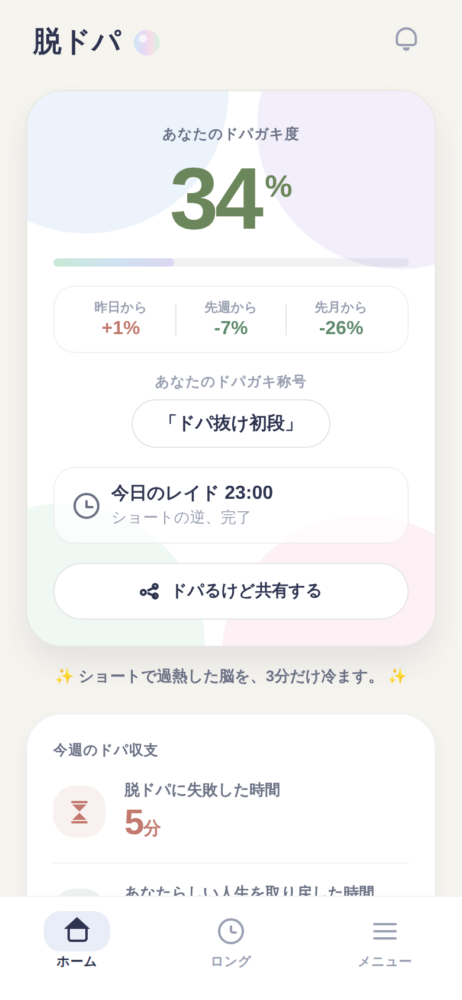 | 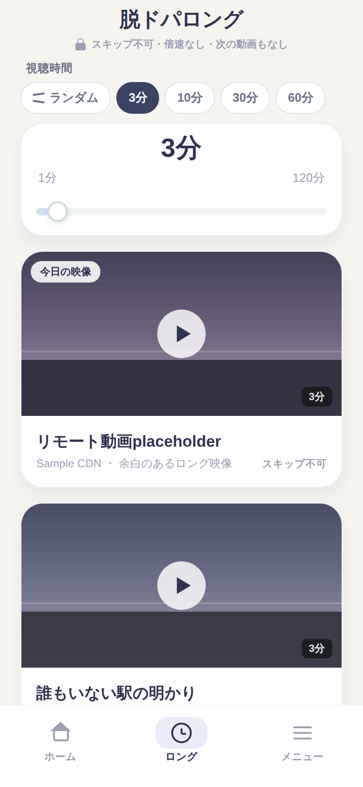 | 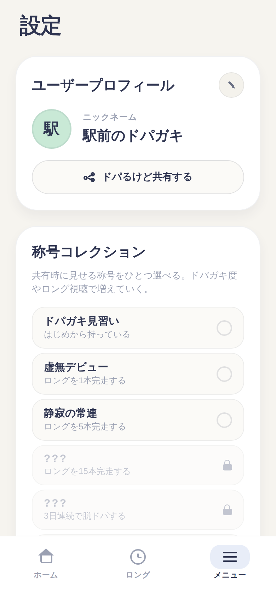 | 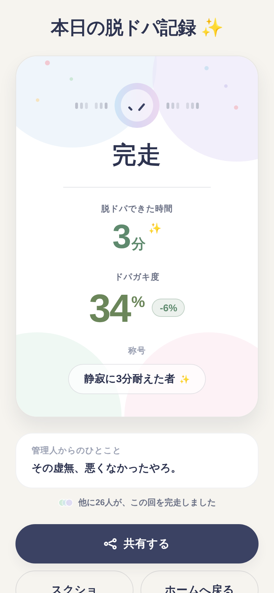 |

### 良い点(維持すべき資産)

- **配色とトーンはすでに強い。** オフホワイト背景 + ネイビー文字 + 低彩度パステルは一貫していて、theme.tsのトークン運用も守られている。「AIっぽいUI」感はほぼない。
- **手描きグリフ**(ベル・時計・ロック・葉っぱ・砂時計)の手作り感はアイデンティティになっている。
- **リザルト画面が一番完成度が高い。** 縦一列の階層、「完走」の大きな文字、管理人のひとこと、「他に26人が完走」のプレゼンス表示のバランスが良い。
- コピーの世界観(「ドパるけど共有する」「虚無に耐えた時間だけ、少し戻ってくる」)はUIの静けさと良い対比になっている。

---

## 2. 改善点

### 2-1. 構造・情報設計

1. **ホームのヒーローカード内に白い小箱が4段重なっている**(デルタ行 / 称号カプセル / レイド行 / 共有ボタン)。CLAUDE.md自身が警告している「カードの中にカードを重ねる過剰なネスト」に近づいており、スコアの主役感が薄まる。→ 区切りはヘアラインや余白に置き換え、面の数を減らす(提案A参照)。
2. **主役のCTAが弱い。** レイド参加はカード内の小さな「参加」ボタンで、同じカード内の「ドパるけど共有する」の方が面積が大きい。1画面1ヒーローの原則に合わせ、参加を唯一の強いボタン、共有はテキストリンク級に格下げする。
3. **ロング画面の階層が薄い。** CLAUDE.mdには「gradient『再生する』ボタンが画面唯一の華」とあるが、現実装(`app/(tabs)/long.tsx`)にはグラデーション再生ボタンが存在せず、カードのタップが再生になっている。意図されていた「今日の映像(ヒーロー) → 時間 → 再生する」の儀式感を復活させる価値が高い(全提案共通で再生ボタンを復元)。
4. **「3分」が同一画面に3回出る。** ロング画面でプリセットChipの選択・スライダー上の巨大な「3分」・カードの「3分」バッジが重複。スライダーは補助入力なので、値表示は1箇所に集約する。
5. **3タブでヘッダー様式がバラバラ。** ホーム=左寄せブランド行、ロング=中央寄せタイトル、メニュー=左寄せ大見出し。どれかに統一すると全体の設計感が出る。
6. **タブ名「メニュー」と画面タイトル「設定」の不一致。** どちらかに揃える(タブを「設定」にするのが簡単)。

### 2-2. ビジュアル・ディテール

7. **日本語の途中改行。** オンボーディング1枚目が「ドパ中毒か / ら離れよう」と語中で折り返す(`images/current/01-onboarding-start.png`)。見出し系のTextには `lineBreakStrategyIC="standard"`(iOS)/ `textBreakStrategy="balanced"`(Android)を指定するか、copy.ts側に改行を入れる。
8. **✨の使いすぎ。** ホームのキャッチコピーは両側✨で挟んでおり(`app/(tabs)/index.tsx` catchphrase)、リザルトのタイトルにも✨。ガイドの「限定使用」方針に合わせ、片側または削除に。
9. **ベルアイコンが死んでいる。** `index.tsx` の onPress が空。通知設定(メニュー)への導線にするか、当面は非表示に。
10. **スコアバーが装飾に見える。** 高さ7pxで数値との関係が読み取りにくい。少し下げ位置と余白を整えるか、100%側に淡い目盛りを1本入れると「メーター」として機能する。
11. **「あなたらしい人生を取り戻した時間」が長すぎて折り返す**(WeeklyBalanceCard)。「取り戻した時間」に短縮しても世界観は保てる(むしろ静かになる)。
12. **ADプレースホルダーが大きな無地ブロック**で目立つ。高さを抑え「AD」ラベルはそのまま、角丸をカードと揃えると静かになる。
13. **メニューの称号コレクションが長く、通知設定が2スクロール下**に沈む。称号は横スクロール1行 or 折りたたみにすると設定系が上がってくる。

### 2-3. 触った時の気持ちよさ(UX)

14. **完走済みの状態が地味。** 「ショートの逆、完了」の行は良いコピーなのに視覚的にはグレーの1行。完了日はレイド行をセージグリーンの淡い面にする程度の「静かなご褒美」があってよい。
15. **ランダムChip(◎)の結果が見えない。** ランダムを押しても選択状態がどのプリセットにも付かず、スライダーの数字だけが変わる。押した後に「今日は○分」の1行フィードバックが欲しい。
16. **リザルトの「スクショ」ボタン**はアラートを出すだけで、初見ではボタンで撮れると誤解する。ラベルを「スクショOK」にする等、案内であることを示す。

---

## 3. デザイン提案(3方向)

いずれも theme.ts の既存トークン(色・角丸・影・グラデーション)だけで実装可能な範囲で設計。モックはHTML製だが、レイアウトはすべてRN(Flexbox)で再現できる構成にしている。

### 提案A 「余白と階層」 — いまの延長で一番洗練させる(推奨)

カードの数を減らし、ヒーロー内の白い小箱をヘアライン区切りに置き換える。スコアをさらに大きく(82px)、デルタは箱をやめて1行のインラインに。レイド行をカード下部の「アクションゾーン」にして参加ボタンを唯一の主役に。共有は下線テキストへ格下げ。ロングは「今日の映像 → セグメント式の時間選択 → gradient再生ボタン」の一直線構成でCLAUDE.mdの意図を復元。

| ホーム | ロング |
|---|---|
| 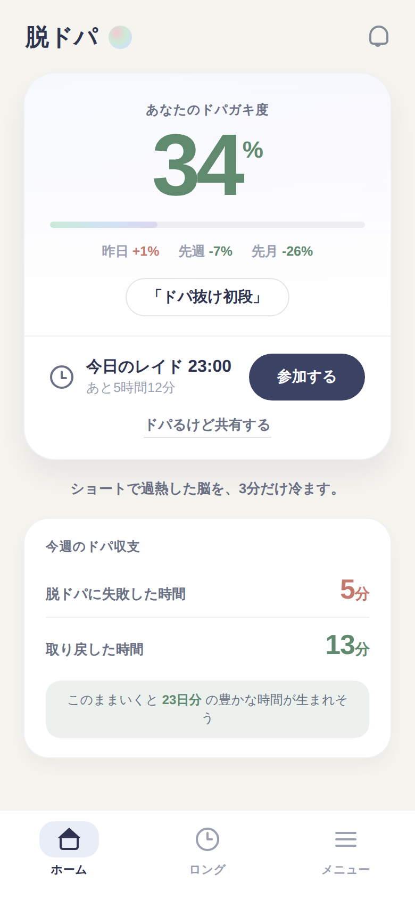 | 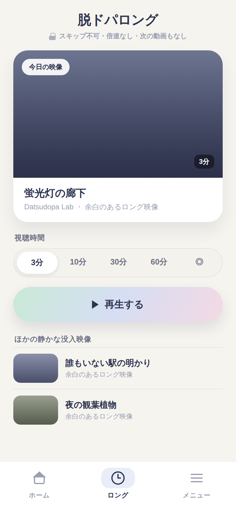 |

実装ポイント:
- DopaHeroCard内の `deltaRow` / `titleCapsule` / `raidBox` の背景・borderを外し、`height: StyleSheet.hairlineWidth` の区切り線と余白で階層を作る
- 参加ボタンは `PrimaryButton`(navy)をレイド行右に、共有は `Text` + `borderBottomWidth` に変更
- ロングの時間選択は `surface` 背景のpill内に白いpillが乗るセグメント(既存Chipの流儀で新部品 `SegmentedPills` を `src/components/ui/` に追加)
- 再生ボタンは `SoftGradient`(gradientPlay)+ pill radius、これが画面唯一の華

### 提案B 「やわらかポップ」 — ネタと親しみやすさに寄せる

スコアを白い円(バブル)に載せ、デルタをパステルのスタンプ風チップに。称号は吹き出し、レイドは切符(チケット)型で「毎日の集合イベント」感を出す。ドパ収支はピンク/ミントの2枚タイルで「失敗↔取り戻し」の対比を直感化。ふざけた世界観(ドパガキ・虚無)と一番相性が良い方向。

| ホーム | ロング |
|---|---|
| 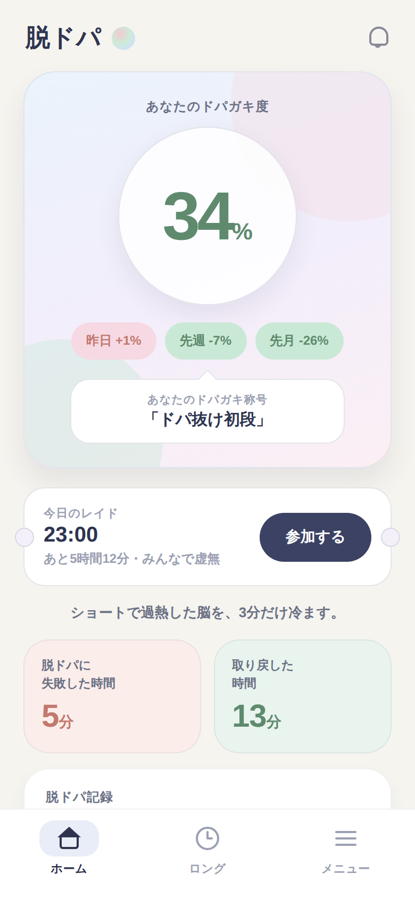 | 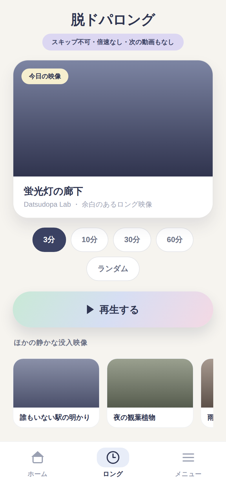 |

実装ポイント:
- スコアバブルは `View`(borderRadius: 999 + `rgba(255,255,255,0.85)` + soft shadow)で実装、PastelWashの上に置く
- チケットの切り欠きは左右に背景色の小円を `position: absolute` で重ねるだけ(新規依存なし)
- 収支タイルは `dangerSoft` / `accentSoft` より一段濃い専用トークン(`#FBEDEA` / `#E9F4EE`)をthemeに追加
- 吹き出しの三角は `transform: rotate(45deg)` の正方形で表現可能

### 提案C 「一枚の紙」 — カードをやめるエディトリアル路線

カードという面を捨て、背景の上に太罫線・細罫線で組む「印刷物」風。スコア96pxを左寄せ、デルタは右端に3行組。すべての情報が1枚に収まり、スクロールがほぼ不要になる。ウェルネスアプリの型から一番遠く、「静かな高級感」は最も強いが、既存コンポーネント(Card前提)からの改修量は最大。

| ホーム | ロング |
|---|---|
| 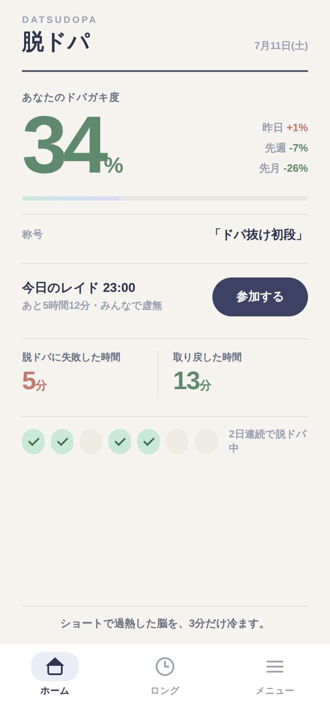 | 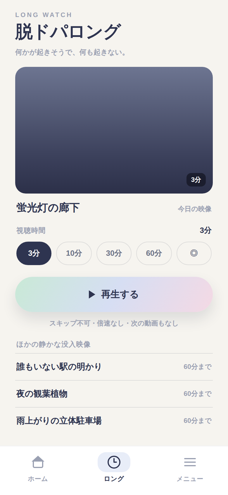 |

実装ポイント:
- `Card` を使わず各セクションを `borderTopWidth` で区切る。太罫線は `height: 1.5, backgroundColor: colors.text`
- スタンプ列はRecordCardのStampMarkを流用して直近7日を横1列に
- 英字kicker(`DATSUDOPA` / `LONG WATCH`)は `typography.englishKicker` の数少ない正当な使い所

### 推奨

**まずAを本線に、Bの要素(レイドのチケット化、収支の2枚タイル)を部分採用**するのが費用対効果が高い。Aは既存構造の整理なので回帰リスクが小さく、CLAUDE.mdの原則(1画面1ヒーロー、光る演出の限定)にもっとも素直に沿う。Cは将来の大型リニューアル候補として保管。

---

## 4. すぐやれるクイックウィン(提案と独立に実施可能)

1. 見出しTextの日本語改行対策(オンボーディング・ホーム)
2. ✨をキャッチコピー片側のみに削減
3. ベルアイコンの削除 or メニュー通知設定への導線化
4. 「あなたらしい人生を取り戻した時間」→「取り戻した時間」
5. タブ名とメニュー画面タイトルの統一
6. ロングのスライダー値表示を1箇所に集約
7. ロングに gradient「再生する」ボタンを復元(CLAUDE.md記載の意図)
8. 完走済みの日のレイド行を accentSoft の淡い面にする

---

## 5. 提案Aの実装結果

提案Aはこのブランチで実装済み。実装後にExpo Webで再度実操作して確認したスクリーンショット:

| ホーム(完走後) | ロング | ロング(ランダム選択後) |
|---|---|---|
| 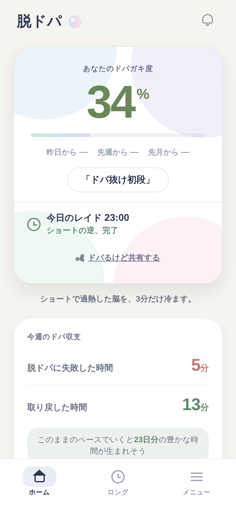 | 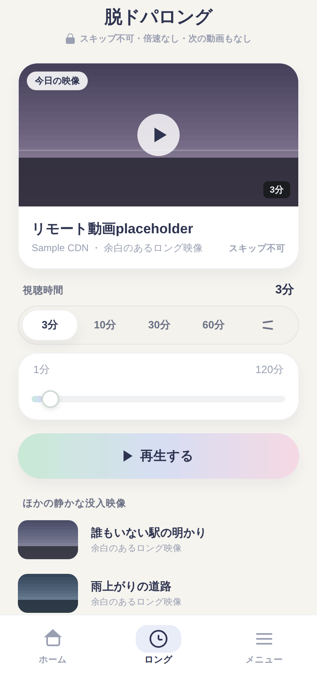 | 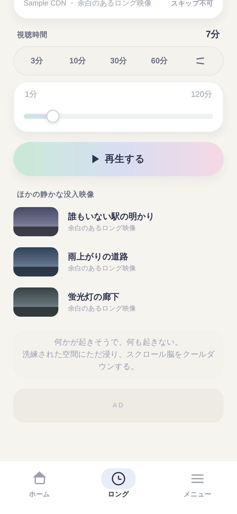 |

実装内容:

- **DopaHeroCard**: デルタ行・レイド行の白い小箱を廃止し、ヘアライン区切り+余白の階層に変更。スコアは `typography.score` トークンに統一。参加ボタン(canStart時 / __DEV__確認用)がカード内唯一の強いボタンになり、共有は下線テキストリンクへ。完走後はレイド行のステータスがセージグリーンになる「静かなご褒美」を追加
- **WeeklyBalanceCard**: アイコンバッジをやめ、ラベル左・数値右のベースライン揃え行+ヘアライン区切りに。「あなたらしい人生を取り戻した時間」→「取り戻した時間」(copy.ts)
- **ロング画面**: 「今日の映像(ヒーロー) → 視聴時間(セグメント+スライダー) → gradient『再生する』」の一直線構成に再編。CLAUDE.mdに記載の「再生するボタンが画面唯一の華」を復元。他の映像はコンパクトな行リストに。時間の値表示はセクション見出し右の1箇所に集約(従来は3箇所)
- **新規UI部品**: `src/components/ui/SegmentedPills.tsx`(Chipの流儀のセグメント選択)
- **クイックウィン**: キャッチコピーの✨を削除、ベルアイコンをメニュー(通知設定)への導線化
- 既存ロジック(canStart / __DEV__ボタン / missed記録 / 再生パラメータ / AdBanner配置)は不変。`npm run typecheck` 通過

### 検証メモ

- Expo SDK 56 / React Native 0.85 のWebビルドで確認(`react-native-google-mobile-ads` と `expo-notifications` はWeb非対応のためローカル限定のシムで代替。リポジトリには含めていない)
- スクリーンショットはPlaywright(390×844 @2x)で取得。実データ相当のダミー記録(12日分・ドパガキ度34%)をAsyncStorage(localStorage)に注入して撮影
